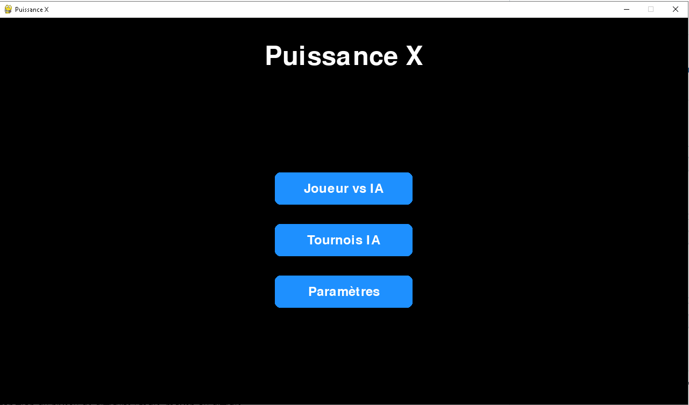
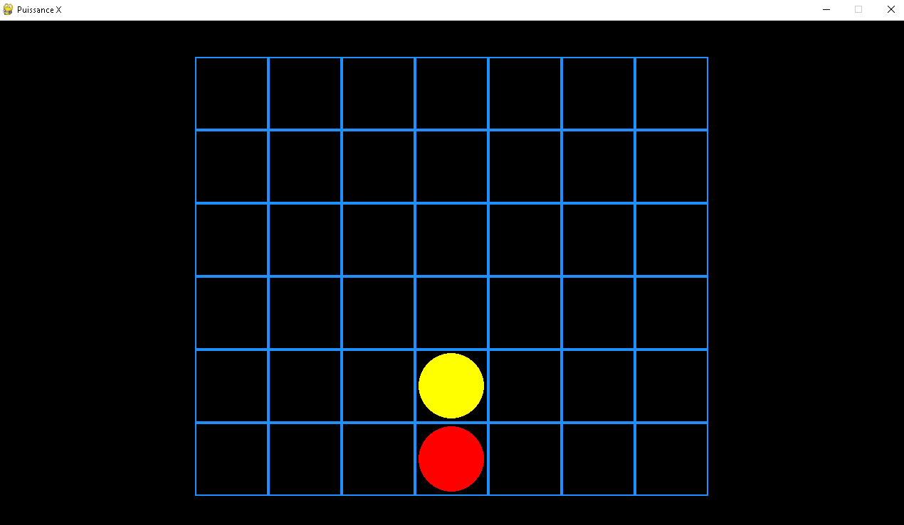
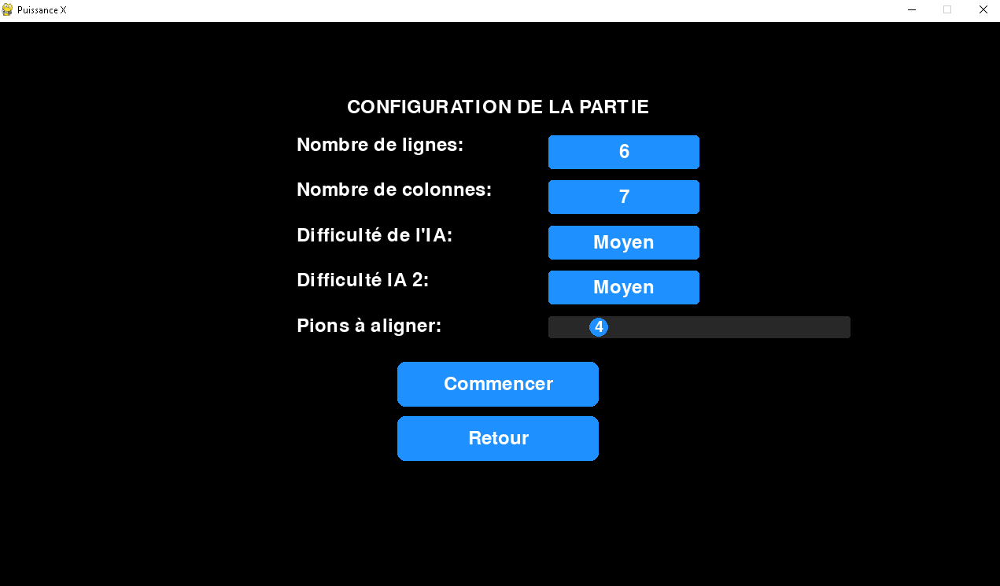

# Puissance4 

## Description

**Puissance X** est un jeu de société où un joueur humain affronte une **Intelligence Artificielle (IA)**. Le jeu se joue sur un plateau de 6 lignes et 7 colonnes. L'objectif est d'aligner 4 jetons consécutifs (horizontalement, verticalement ou en diagonale). L'IA utilise l'algorithme **Minimax avec élagage alpha-bêta** pour déterminer ses mouvements en fonction du niveau de difficulté : facile, moyen ou difficile.

### Fonctionnalités

- **Jeu à 2 joueurs** : Un joueur humain contre l'IA.
- **Trois niveaux de difficulté** : Facile, moyen, difficile.
- **Algorithme Minimax avec élagage alpha-bêta** pour le choix des mouvements de l'IA.
- **Interface graphique** : Utilisation d'une interface pour une expérience de jeu agréable.
- **Évaluation avancée des positions** en fonction du contrôle du centre du plateau et des configurations gagnantes.

## Structure du projet

Puissance4/ ├── interface.py # Interface graphique du jeu (utilise une bibliothèque comme tkinter ou pygame) ├── game.py # Logique du jeu, qui gère les interactions entre l'utilisateur et l'IA ├── game_logic.py # Logique de base du jeu (vérification des coups, ajout des pièces, vérification de la victoire) ├── constants.py # Constantes du jeu (dimensions du plateau, pièces du joueur et de l'IA) ├── ai.py # Implémentation de l'IA utilisant l'algorithme Minimax └── main.py # Script principal pour démarrer le jeu
## Installation

1. Clonez le dépôt :

git clone https://github.com/fayssalzakaria/puissance4.git

2. Accédez au dossier du projet :

cd puissance4

3. Assurez-vous d'avoir installé les dépendances nécessaires avec les commande suivantes :

  pip install numpy
  pip install pygame
## Screenshots

Voici quelques captures d'écran du projet :

##  Auteurs  
**Fayssal**  
- Email : fayssal.132004@gmail.com
  
**Nicolas**  
